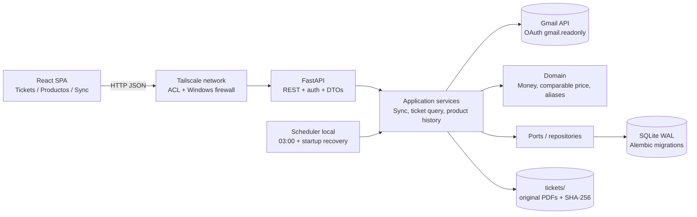

# Arquitectura local-first

La aplicación se ejecuta en el PC del usuario: el backend posee el dominio, la base de datos y los PDF; el frontend es un cliente del backend. La red no es una frontera de confianza: el acceso remoto se limita a Tailscale y a un token local de aplicación.

## Diagrama de componentes

## Capas y límites

| Capa | Responsabilidad | No debe hacer |
|---|---|---|
| `domain` | Entidades, value objects, invariantes, cálculo de dinero y precio comparable | Leer Gmail, SQL, HTTP o React |
| `application` | Casos de uso: importar, deduplicar, listar, detallar, construir historial, iniciar sync | Conocer componentes visuales o detalles de SQLite |
| `infrastructure` | Gmail OAuth/client, parser PDF, filesystem, SQLAlchemy/Alembic, scheduler | Decidir reglas de negocio o formar respuestas HTTP |
| `api` | Rutas, auth local, validación Pydantic, serialización, códigos HTTP | Recalcular precios o consultar tablas directamente |
| `frontend` | Presentación, navegación, accesibilidad, caché/query y estado visual | Implementar deduplicación, parsing o cálculos de dominio |

Los repositorios se expresan como puertos consumidos por `application`. La implementación SQLite usa SQLAlchemy 2 y puede sustituirse por PostgreSQL sin cambiar entidades ni casos de uso. Pydantic sólo traduce DTOs en el borde; los servicios reciben tipos de dominio.

## Extracción de PDF

La primera versión usa `pypdf` para extraer el texto embebido del PDF de forma
determinista, reproducible y sin enviar tickets a un servicio externo. No usa
OCR: un documento sin texto extraíble queda archivado con estado `failed` para
revisión y reintento. El parser conserva sólo un extracto acotado para
auditoría y nunca escribe el contenido completo en logs.

## Flujo de importación

1. Scheduler o usuario crea un `sync_run` con modo `backfill`, `incremental` o `manual`.
2. `GmailMessageFetcher` consulta Gmail con la query verificada y páginas de resultados.
3. Se registra cada `provider_message_id` antes de procesar el adjunto; la restricción única hace idempotente el reintento.
4. `PdfArchive` valida, escribe el PDF fuera de la raíz pública y calcula SHA-256.
5. `TicketParser` extrae fecha, número, total y líneas; guarda el `parser_version` y el estado de parsing.
6. `TicketImportService` aplica normalización conservadora, resuelve alias inequívocos y calcula `comparablePriceCents` con `Decimal`.
7. Una transacción confirma mensaje, ticket, líneas y resultado de la ejecución. Los fallos por mensaje se registran como errores accionables sin perder el resto del lote.

### Recuperación al arrancar

El proceso de arranque inspecciona ejecuciones `running` o ventanas nocturnas vencidas. Marca la ejecución interrumpida como `failed` con causa `host_shutdown` y lanza una incremental si han pasado más de 24 horas desde la última ejecución exitosa. No se asume que el PC estuvo encendido: el usuario debe verlo en el estado de sincronización.

## Persistencia y consistencia

- SQLite usa WAL, foreign keys activadas, busy timeout y transacciones cortas.
- Todos los identificadores públicos son UUID opacos. SQLite los almacena como texto; PostgreSQL podrá usar `uuid`.
- Dinero persistido en céntimos enteros. Cantidades de parsing se modelan como `NUMERIC`; el dominio usa `Decimal`.
- Eventos técnicos (`sync_runs`, `gmail_messages`) son UTC. La compra conserva fecha/hora local y `Europe/Madrid`.
- El PDF original es inmutable: un SHA-256 ya archivado no se sobrescribe. Un mismo mensaje con un adjunto cambiado genera un error de integridad para revisión, no una sustitución silenciosa.
- Si otro mensaje contiene un PDF con SHA-256 ya archivado, el importador conserva el registro del mensaje, lo cuenta como duplicado y no crea otro ticket; el hash no es una identidad de negocio independiente del mensaje.

## API y frontend

El prefijo REST es `/api/v1`. Las respuestas contienen datos ya listos para presentar: totales en céntimos, base comparable, estados y resumen de variación. TanStack Query gestiona datos remotos, invalidación y estados de carga; Zustand se limita a menú móvil, filtros de interfaz y preferencias visuales. Recharts y la tabla accesible consumen el mismo array `priceHistory`.

## Operación local y acceso móvil

- El servicio escucha localmente por defecto. Para móvil se habilita explícitamente el acceso por la interfaz Tailscale, se restringe Windows Firewall al adaptador Tailscale y se configura la ACL de la tailnet.
- El frontend móvil usa la URL HTTPS/hostname de Tailscale configurada; no se hace port-forwarding.
- La API exige el token local de aplicación en accesos no-locales. El token no es el token OAuth de Gmail.
- Si el PC está apagado, no se puede consultar la aplicación remotamente y no se ejecuta la sincronización de las 03:00; al volver a arrancar se intenta la recuperación descrita arriba.

## Amenazas y controles

| Amenaza | Control |
|---|---|
| Exposición accidental a Internet | Bind local por defecto, firewall, sin UPnP ni port-forwarding, acceso remoto sólo por Tailscale |
| Acceso de otro dispositivo de la tailnet | ACL de Tailscale + token de aplicación + CORS allowlist |
| Robo de OAuth | `gmail.readonly`, refresh token fuera de Git, permisos del usuario y almacén seguro del SO |
| Secreto en logs | Redacción de Authorization, tokens, cuerpos de Gmail y rutas sensibles |
| PDF malicioso o costoso | MIME/size limits, parser aislado con timeout, PDF fuera de raíz pública |
| Inyección SQL | SQLAlchemy parametrizado, sin SQL construido con entrada de usuario |
| Datos personales en backups | Directorio protegido, backups cifrados y retención definida por el usuario |
| CSRF desde un origen permitido | Token explícito para accesos remotos; no usar cookies de sesión para la API móvil |

## Decisiones fuera de alcance en esta fase

- Multiusuario, roles, compartir tickets o telemetría externa.
- Hosting público, sincronización con servicios distintos de Gmail y edición del PDF original.
- Fusión automática de productos por similitud semántica.

Las decisiones de local-first y Tailscale se formalizan en [`adr/0001-local-first.md`](adr/0001-local-first.md).
