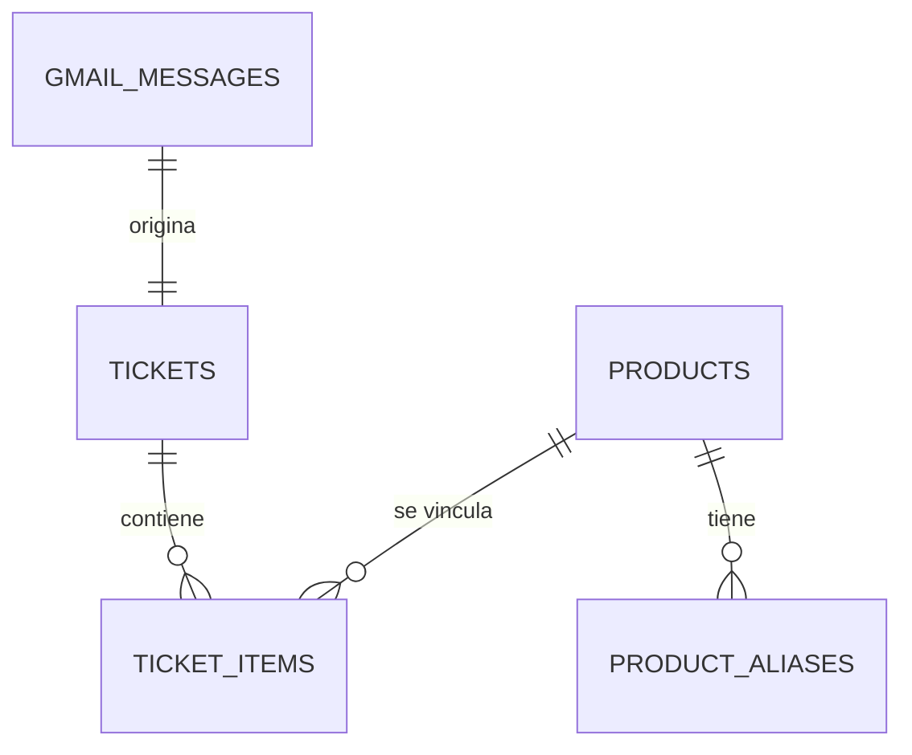

# Modelo de datos

Este modelo es lógico y portable. Los tipos `UUID`, `TIMESTAMP WITH TIME ZONE` y `NUMERIC` se mapean a representaciones equivalentes de SQLite durante la primera implementación y a tipos nativos de PostgreSQL en una migración posterior.

## Convenciones

- Todas las tablas tienen `id UUID` salvo donde se indique una clave natural técnica.
- `created_at_utc` y `updated_at_utc` son instantes UTC.
- Dinero: `*_cents INTEGER` no negativo; nunca `FLOAT`.
- Cantidad: `NUMERIC(12,3)` para conservar lo extraído; el dominio usa `Decimal`.
- Estados se validan en dominio y, cuando sea posible, con `CHECK`.
- Los nombres originales del PDF no se sustituyen por los normalizados.

## `gmail_messages`

| Campo | Tipo | Nulo | Restricción / uso |
|---|---|---:|---|
| `id` | UUID | No | PK interna |
| `provider_message_id` | VARCHAR(255) | No | UNIQUE; ID estable de Gmail |
| `thread_id` | VARCHAR(255) | Sí | Trazabilidad Gmail |
| `sender` | VARCHAR(320) | No | Remitente observado |
| `subject` | VARCHAR(998) | Sí | Asunto para auditoría, no identidad |
| `received_at_utc` | TIMESTAMPTZ | Sí | Fecha técnica |
| `attachment_filename` | VARCHAR(255) | No | Nombre original |
| `attachment_size_bytes` | BIGINT | No | `> 0`, límite configurable |
| `attachment_sha256` | CHAR(64) | No | Índice; no se sobrescribe |
| `original_pdf_path` | VARCHAR(1024) | No | Ruta relativa a `tickets/` |
| `parse_status` | VARCHAR(16) | No | `pending`, `ready`, `partial`, `failed` |
| `parser_version` | VARCHAR(32) | Sí | Versión que procesó el PDF |
| `parse_error_code` | VARCHAR(64) | Sí | Código accionable sin secretos |
| `created_at_utc` | TIMESTAMPTZ | No | Auditoría |

Índices: UNIQUE `provider_message_id`, INDEX `(received_at_utc)`, INDEX `(attachment_sha256)`. El hash no es UNIQUE porque dos mensajes pueden adjuntar el mismo PDF; el servicio usa el índice para detectar y contar ese duplicado sin crear otro ticket.

## `tickets`

| Campo | Tipo | Nulo | Restricción / uso |
|---|---|---:|---|
| `id` | UUID | No | PK pública opaca |
| `gmail_message_id` | UUID | No | FK a `gmail_messages`, UNIQUE |
| `ticket_number` | VARCHAR(64) | Sí | Número impreso; no identidad única global |
| `purchased_at_utc` | TIMESTAMPTZ | No | Orden técnico estable |
| `purchased_local_date` | DATE | No | Fecha en Europe/Madrid |
| `purchased_local_time` | TIME | Sí | Hora si el PDF la contiene |
| `purchased_timezone` | VARCHAR(32) | No | CHECK = `Europe/Madrid` |
| `total_cents` | INTEGER | No | Importe total del ticket |
| `parse_status` | VARCHAR(16) | No | `ready`, `partial`, `failed` |
| `created_at_utc` | TIMESTAMPTZ | No | Auditoría |
| `updated_at_utc` | TIMESTAMPTZ | No | Auditoría |

Índices: UNIQUE `(gmail_message_id)`, INDEX `(purchased_at_utc DESC, id DESC)`, INDEX `(purchased_local_date)`.

## `products`

| Campo | Tipo | Nulo | Restricción / uso |
|---|---|---:|---|
| `id` | UUID | No | PK |
| `canonical_name` | VARCHAR(255) | No | Nombre mostrado, no borra el raw |
| `normalization_key` | VARCHAR(255) | No | Clave conservadora |
| `comparable_basis` | VARCHAR(8) | No | `unit` o `kg` |
| `status` | VARCHAR(16) | No | `active` o `review` |
| `created_at_utc` | TIMESTAMPTZ | No | Auditoría |
| `updated_at_utc` | TIMESTAMPTZ | No | Auditoría |

Restricción UNIQUE `(normalization_key, comparable_basis)`. La base forma parte de la identidad para impedir mezclar series por unidad y por kg.

## `product_aliases`

| Campo | Tipo | Nulo | Restricción / uso |
|---|---|---:|---|
| `id` | UUID | No | PK |
| `product_id` | UUID | No | FK a `products` |
| `raw_description` | VARCHAR(255) | No | Texto observado |
| `normalized_description` | VARCHAR(255) | No | Texto normalizado |
| `normalization_key` | VARCHAR(255) | No | Clave comparada |
| `comparable_basis` | VARCHAR(8) | No | `unit` o `kg` |
| `resolution` | VARCHAR(16) | No | `automatic` o `reviewed` |
| `normalization_version` | VARCHAR(32) | No | Reproducibilidad |
| `created_at_utc` | TIMESTAMPTZ | No | Auditoría |

Índice UNIQUE `(normalization_key, comparable_basis)`. Si una clave puede referir a dos productos, no se crea alias automático: la línea queda sin vincular.

## `ticket_items`

| Campo | Tipo | Nulo | Restricción / uso |
|---|---|---:|---|
| `id` | UUID | No | PK |
| `ticket_id` | UUID | No | FK a `tickets` con delete restrict |
| `line_index` | INTEGER | No | Posición del PDF; UNIQUE por ticket |
| `product_id` | UUID | Sí | FK a `products`; null si no resuelto |
| `raw_description` | VARCHAR(255) | No | Descripción exacta |
| `normalized_description` | VARCHAR(255) | Sí | Resultado conservador |
| `quantity` | NUMERIC(12,3) | Sí | Número de unidades |
| `quantity_unit` | VARCHAR(8) | No | `unit`, `kg`, `unknown` |
| `weight_grams` | INTEGER | Sí | Peso cobrado; requerido para `kg` |
| `explicit_unit_price_cents` | INTEGER | Sí | Precio unitario informado |
| `line_amount_cents` | INTEGER | No | Importe de línea |
| `comparable_price_cents` | INTEGER | Sí | Céntimos por base |
| `comparable_basis` | VARCHAR(8) | Sí | `unit` o `kg` |
| `parse_status` | VARCHAR(16) | No | `ready`, `partial`, `failed` |
| `parse_note` | VARCHAR(255) | Sí | Motivo sin datos sensibles |

Índices: UNIQUE `(ticket_id, line_index)`, INDEX `(product_id, ticket_id)`, INDEX `(ticket_id, line_index)`.

### Invariantes de líneas

- `line_amount_cents >= 0`.
- `quantity_unit = unit` implica `quantity > 0` y `comparable_basis = unit` si la línea es `ready`.
- `quantity_unit = kg` implica `weight_grams > 0` y `comparable_basis = kg` si la línea es `ready`.
- `comparable_basis = unit` nunca se combina con `weight_grams` como base gráfica; el peso puede conservarse sólo si el PDF lo informa adicionalmente.
- `parse_status = ready` requiere `comparable_price_cents`, excepto líneas que el dominio marque explícitamente no comparables.

## `sync_runs`

| Campo | Tipo | Nulo | Restricción / uso |
|---|---|---:|---|
| `id` | UUID | No | PK |
| `mode` | VARCHAR(16) | No | `backfill`, `incremental`, `manual`, `recovery` |
| `status` | VARCHAR(16) | No | `queued`, `running`, `succeeded`, `partial`, `failed` |
| `started_at_utc` | TIMESTAMPTZ | Sí | Auditoría |
| `finished_at_utc` | TIMESTAMPTZ | Sí | Auditoría |
| `query` | VARCHAR(2000) | Sí | Query de Gmail usada |
| `matched_messages` | INTEGER | No | Contadores no negativos |
| `imported_tickets` | INTEGER | No | Contadores |
| `skipped_duplicates` | INTEGER | No | Contadores |
| `partial_tickets` | INTEGER | No | Contadores |
| `error_count` | INTEGER | No | Contadores |
| `last_error_code` | VARCHAR(64) | Sí | Último código accionable |
| `watermark_received_at_utc` | TIMESTAMPTZ | Sí | Marca incremental |
| `created_at_utc` | TIMESTAMPTZ | No | Auditoría |

Índice: `(created_at_utc DESC)`. Sólo una ejecución activa por proceso; el lock de aplicación y la idempotencia de tablas protegen frente a doble disparo.

## Relaciones

`sync_runs` no tiene una FK directa en el modelo mínimo: sus contadores, `last_error_code` y el estado por mensaje cubren la operación inicial. Si se necesita auditoría mensaje-a-mensaje, se añadirá una tabla `sync_run_messages` en una migración explícita.
